
<picture>
  <source media="(prefers-color-scheme: dark)" srcset="https://raw.githubusercontent.com/devvicha/devvicha/main/assets/header-dark.svg">
  
</picture>

  
  
  

  <a href="#tour"><kbd>⚡ 60 second tour</kbd></a>&nbsp;
  <a href="#hiring"><kbd>🧭 Hiring for…</kbd></a>&nbsp;
  <a href="#work"><kbd>🛠️ Featured work</kbd></a>&nbsp;
  <a href="#research"><kbd>🔬 Research</kbd></a>&nbsp;
  <a href="#journey"><kbd>📈 Journey</kbd></a>&nbsp;
  <a href="#toolbox"><kbd>🧰 Toolbox</kbd></a>&nbsp;
  <a href="#ask-me"><kbd>💬 Ask me about</kbd></a>

> [!TIP]
> **Interviewing me?** Read the tour (it really is 60 seconds), use the table to jump to the work closest to your role, then expand any section for the architecture, the decisions behind it and the results. Most of my production code is private; I'm happy to walk through it live.

## ⚡ The 60 second tour

**ආයුබෝවන්, I'm Vichaksha.** I'm an AI/ML engineer from Sri Lanka who likes taking models out of notebooks and putting them in front of real people.

- 🤖 **Associate AI/ML Engineer at Surge Robotics** since September 2025.
- 💬 **Production WhatsApp AI agents** serving **10K+ customers a day**. Order taking LLM agents on a NestJS and PostgreSQL platform with idempotent ingestion, Redis backed duplicate guards, SQL audit trails, human takeover and LLM observability with Fiddler AI.
- 🔬 **Low resource speech research.** I adapted Whisper large v2 with LoRA to transcribe Sinhala song lyrics for copyright detection, training only about 1% of its weights. The paper is accepted at **SICET 2026**.
- 👁️ **Computer vision for apparel.** A garment measurement system using YOLOv8 pose keypoints, ChArUco calibration and an MLflow continuous training loop, built with Idea8 (Pvt) Ltd and the University of Sri Jayewardenepura.
- 🎓 **BSc (Hons) in Electronics & Computer Science**, University of Kelaniya, where I also served as Secretary of the IEEE IES Student Branch Chapter.

## 🧭 Hiring for…? Start here

| If the role is | Look at | Ask me about |
|:--|:--|:--|
| 🧠 **AI / ML Engineer** | [Sinhala Lyrical ASR](#asr) · [Garment Measurement](#garment) | Why LoRA instead of full fine tuning, chunking long audio, keypoint design |
| 🤖 **LLM / AI Agent Engineer** | [WhatsApp AI Agents](#whatsapp) · [Voice Agents](#voice) | Keeping the model out of the maths, duplicate order protection, human takeover, Fiddler AI monitoring |
| ⚙️ **MLOps / ML Platform** | [WhatsApp AI Agents](#whatsapp) · [Garment Measurement](#garment) | CI/CD to staging and production, LLM observability, continuous training with MLflow |
| 🎙️ **Voice / Conversational AI** | [Voice Agents](#voice) · [WhatsApp AI Agents](#whatsapp) | Realtime streaming, reconnect strategy, tool calling, Sinhala STT and TTS |
| 👁️ **Computer Vision** | [Garment Measurement](#garment) · [More from the lab](#lab) | Pixel to millimetre calibration, dataset leakage, pose models |
| 🧩 **Backend / Full stack** | [WhatsApp AI Agents](#whatsapp) · [SmartForce HRMS](#hrms) | SQL schema design, idempotency, ledgers, WebSockets, microservices |
| 🔌 **Embedded / IoT** | [Smart Desk Assistant](#smartdesk) · [easyPark](#lab) | ESP32 with FreeRTOS, MQTT over TLS, device provisioning |

## 🛠️ Featured work

Click a card to jump to its story. Every story has a collapsible deep dive.

<a href="#whatsapp"><picture><source media="(prefers-color-scheme: dark)" srcset="https://raw.githubusercontent.com/devvicha/devvicha/main/assets/cards/whatsapp-dark.svg"></picture></a>
<a href="#asr"><picture><source media="(prefers-color-scheme: dark)" srcset="https://raw.githubusercontent.com/devvicha/devvicha/main/assets/cards/asr-dark.svg"></picture></a>
<a href="#garment"><picture><source media="(prefers-color-scheme: dark)" srcset="https://raw.githubusercontent.com/devvicha/devvicha/main/assets/cards/garment-dark.svg"></picture></a>
<a href="#voice"><picture><source media="(prefers-color-scheme: dark)" srcset="https://raw.githubusercontent.com/devvicha/devvicha/main/assets/cards/voice-dark.svg"></picture></a>
<a href="#smartdesk"><picture><source media="(prefers-color-scheme: dark)" srcset="https://raw.githubusercontent.com/devvicha/devvicha/main/assets/cards/smartdesk-dark.svg"></picture></a>
<a href="#hrms"><picture><source media="(prefers-color-scheme: dark)" srcset="https://raw.githubusercontent.com/devvicha/devvicha/main/assets/cards/hrms-dark.svg"></picture></a>

---

### 💬 Production WhatsApp AI Agents · built to run, not just to demo

**Role:** end to end owner of the agent, API, database and deployments &nbsp;·&nbsp; **Scale:** 10K+ customers a day &nbsp;·&nbsp; **Code:** private client systems, happy to walk through them live

LLM agents that answer customers, take orders and hand conversations to staff on WhatsApp for Sri Lankan businesses. The chat is the easy part. Behind it sits a multi tenant NestJS platform on PostgreSQL, designed so that retries, double taps and model mistakes never turn into duplicate orders or wrong totals.

| Practice | How I built it | Why it matters |
|:--|:--|:--|
| 🗄️ **Relational data model** | PostgreSQL with Prisma: 25 tables, 16 enums, 50 unique constraints and indexes, 42 versioned migrations including data backfills | Orders, payments and conversations need integrity and history, not a JSON blob |
| 🔁 **Idempotency by design** | Unique `(tenant, wamid)` on messages, `(tenant, external order id)` on orders, unique provider event ids on payments, Redis `SET NX EX` message claims | WhatsApp and payment providers redeliver; a retry must never create a second order or credit |
| 🧱 **Layered duplicate guards** | Message id dedupe, system event filtering, canonical conversation identity, a per chat processing lock and an order confirmation state machine with an in flight guard | Customers double tap, networks retry, and a model can confirm the same order twice |
| 📒 **Ledgers and audit trails** | Append only usage and credit ledgers, order status history with actor, reason and timestamp | Every balance and every status change can be explained later |
| 🧮 **The model talks, code does the maths** | Prices and delivery charges computed by tested code; an immutable chat snapshot is taken at confirmation; the authoritative phone number is passed to the extractor; unknown values are flagged, never guessed | Stops hallucinated totals and cross customer mixups |
| 🔭 **LLM observability** | Fiddler AI monitoring of agent responses, structured logs, escalation flags with a reason | You can't fix what you can't see |
| 🙋 **Human in the loop** | Escalations, takeover windows, unread counts and a realtime staff inbox over Socket.IO with a Redis adapter | Some conversations need a person, fast |
| 🌐 **Resilient integrations** | Timeouts, exponential backoff on 5xx only, no retry on 4xx, a dead letter log for failed payloads, payload validation | Partial failures stay recoverable instead of silently lost |
| ⚡ **Query driven indexing** | Composite indexes shaped by real queries, such as tenant + status + placed date for revenue analytics | Dashboards stay fast as order history grows |
| 🔐 **Security and tenancy** | JWT for staff, API keys for machine clients, per tenant capability guards, presigned URLs for private media on S3 compatible storage | Tenants and features stay separated |
| ✅ **Tests and delivery** | Jest and node:test suites, including a test that interleaves 100 orders with zero cross customer mixups; Docker images built and deployed by GitHub Actions to staging and production with health checks | Ship often without breaking live chats |

<b>🔍 Architecture</b>

 

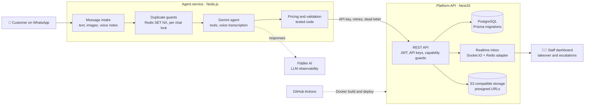

<b>🗄️ Core SQL tables</b>

 

A slice of the schema: the tables behind conversations, orders and money.

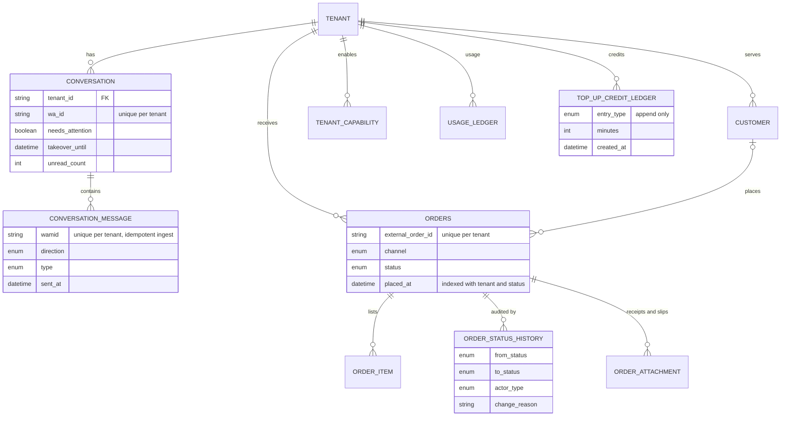

<b>🧱 How one message passes the duplicate guards</b>

 

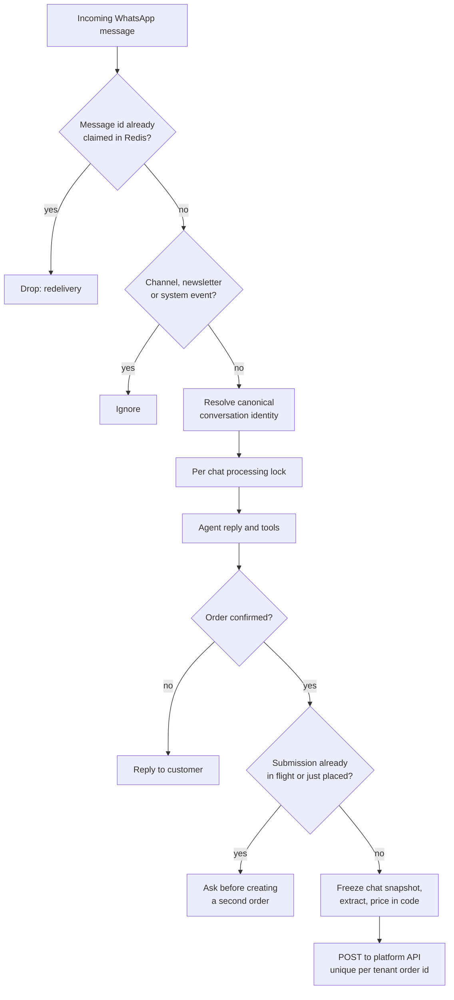

### 🔬 Sinhala Lyrical ASR · Whisper + LoRA for copyright detection

**Context:** final year research, Department of Statistics and Computer Science, University of Kelaniya &nbsp;·&nbsp; **Paper:** *Enhancing Copyright Detection through Lyrics Analysis in Sinhala Song Audio* (SICET 2026) &nbsp;·&nbsp; **Code:** [Whisper-Fine-Tuning-For-Sinhala](https://github.com/devvicha/Whisper-Fine-Tuning-For-Sinhala) · [Fine-Tune-by-vicha](https://github.com/devvicha/Fine-Tune-by-vicha)

Speech models struggle with Sinhala songs: background music, poetic phrasing and stretched pronunciation all get in the way. I adapted Whisper to transcribe lyrics well enough to search and match them for copyright detection. The curve below is plotted straight from the training log in the repo.

<picture>
  <source media="(prefers-color-scheme: dark)" srcset="https://raw.githubusercontent.com/devvicha/devvicha/main/assets/whisper-loss-dark.svg">
  
</picture>

<b>🔍 Pipeline and design decisions</b>

 

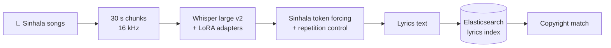

- **LoRA instead of full fine tuning.** Rank 32 adapters (α = 64) on the attention query and value projections train **15.7M parameters, about 1% of the 1.55B model**. It fits on Colab GPUs and keeps Whisper's multilingual ability intact.
- **30 second chunks** match Whisper's input window and turned the song collection into about 54K training clips.
- **Forced Sinhala language token**, so decoding never drifts into another language.
- **Chunking and segmentation logic** to break the repetition loops Whisper falls into on music.
- **Elasticsearch** over the transcribed lyrics for search and copyright detection.

**Stack:** PyTorch · Hugging Face Transformers, PEFT and Datasets · Google Colab · Elasticsearch

### 👁️ Garment Measurement · computer vision that measures clothes

**With:** Idea8 (Pvt) Ltd and the University of Sri Jayewardenepura &nbsp;·&nbsp; **Code:** [Cloth-size-project](https://github.com/devvicha/Cloth-size-project) (public first version) · [Go_Pro_RTMP](https://github.com/devvicha/Go_Pro_RTMP) (camera control and streaming) · production code is private

Garment measurements (chest, shoulder, sleeve, length) are usually taken by hand with a tape. This system reads a garment laid on a green flat lay bed through a camera and returns the measurements in millimetres.

<b>🔍 Architecture, lessons and results</b>

 

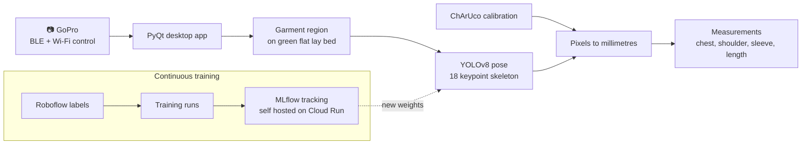

- **Started simple, then hardened it.** The first version used a 12 keypoint T shirt model and one ArUco marker for scale. The current system uses an 18 keypoint skeleton for long sleeve garments and ChArUco boards for calibration.
- **Debugged the data, not just the model.** I traced failures to a corrupted calibration mesh that broke region detection, different garment types sharing one skeleton, and near duplicate burst frames leaking between train and test splits.
- **Continuous training** with MLflow, self hosted on Cloud Run, so every run is tracked as new labeled data comes in.

**Stack:** Python · Ultralytics YOLOv8 · OpenCV (ArUco, ChArUco) · PyQt · Roboflow · MLflow · Google Cloud Run · Open GoPro SDK

### 🎙️ Multilingual Voice Agents · realtime speech in three languages

A series of realtime voice agents built to learn what actually works for Sinhala, Tamil and English callers.

| Project | What it does | What's interesting |
|:--|:--|:--|
| [Car wash booking agent](https://github.com/devvicha/Prestine_car_wash_Project) | Takes bookings by voice, quotes prices, logs complaints | Gemini Live native audio, live transcripts, tool calls validated by an Express + WebSocket backend that pushes booking events in real time |
| [Banking customer care agent](https://github.com/devvicha/sampath-bank-customer-care5_withRAGEMINI) | Answers product and service questions | RAG over a 40+ document knowledge base with FAISS and generated metadata, Sinhala and Tamil voice mode |
| [Resilient streaming](https://github.com/devvicha/RAG-integrated-calling) | Keeps calls alive on bad networks | Auto reconnect with exponential backoff (1 s to 16 s), a circuit breaker and tool error recovery |
| [Sinhala realtime STT](https://github.com/devvicha/Sinhala-Speech-to-text-gcp-Azure) | Live Sinhala captions and spoken replies | Azure Speech streaming, Sinhala neural TTS, Unicode normalisation |
| [Local live transcription](https://github.com/devvicha/Live_English_Transciptining_Iphone_VScode) | Offline English captions | faster-whisper with int8 on Apple Silicon, short windows with rolling context |

<b>🔍 How one voice turn works (booking agent)</b>

 

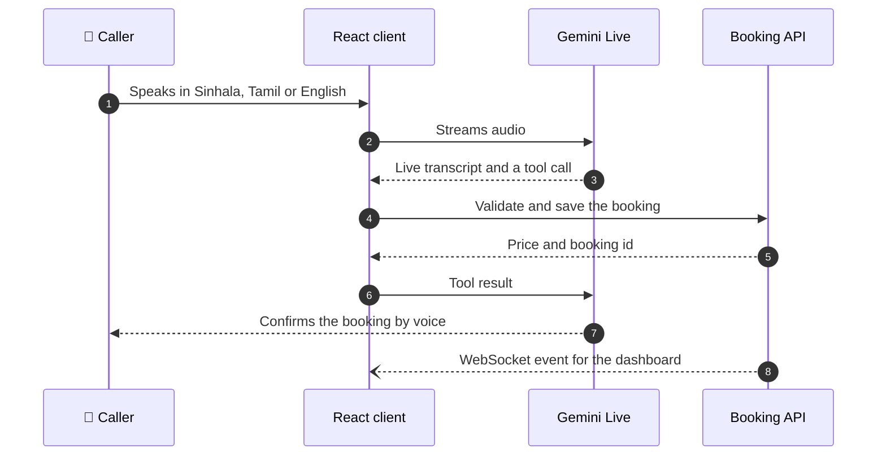

**Stack:** React · TypeScript · Vite · Node.js · Express · WebSockets · Gemini Live API · Azure Speech · faster-whisper · FAISS · Streamlit

### 🔌 Smart Desk Assistant · IoT from sensor to app

**Code:** [SmartDeskAssistant](https://github.com/devvicha/SmartDeskAssistant)

A desk node measures air quality, noise and light, and the app turns those readings into insights about the workspace.

<b>🔍 System design</b>

 

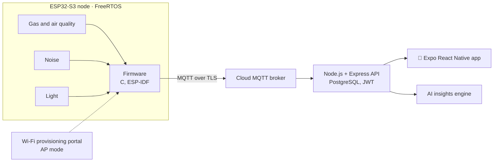

- **Firmware:** FreeRTOS tasks on an ESP32-S3, a provisioning portal for Wi-Fi setup and credentials kept in NVS.
- **Backend:** TypeScript, Express and PostgreSQL with JWT auth for users, devices and readings.
- **Documented like a real system,** with concept maps and rich pictures before any code.

### 🧩 SmartForce HRMS · Spring Boot microservices

**Code:** [HR-Management-System](https://github.com/devvicha/HR-Management-System)

An HR platform split into 10 independent Spring Boot services backed by MongoDB: employees, departments, payroll, leave, attendance, assets, projects, tasks, to do lists and notices. Each service owns its domain and exposes its own REST API.

### 🧪 More from the lab

| Project | What it is | Stack |
|:--|:--|:--|
| [Video SpO2 estimation](https://github.com/devvicha/Opensource_Research) | Contactless blood oxygen estimate from facial video: PPG signals from face regions go into a tiny transformer (4 layers, 2 heads) served with FastAPI | PyTorch · OpenCV · FastAPI |
| [Kite skeletonization](https://github.com/devvicha/Kite_Project) | U²Net segmentation with a learnable thinning layer and Focal Tversky loss to extract kite skeletons | PyTorch · Albumentations |
| [Sign language detection](https://github.com/devvicha/SignLanguageDetection) | Real time sign detection with YOLOv8, exported to ONNX and served with Flask | YOLOv8 · ONNX · Flask |
| [easyPark](https://github.com/devvicha/easyPark) | IoT parking: sensors and a NodeMCU ESP32 update Firebase in real time, and the app guides drivers to free spots | Arduino · Firebase · Google Maps |
| [GoPro control and RTMP](https://github.com/devvicha/Go_Pro_RTMP) | Controls a GoPro from macOS over BLE and Wi-Fi, then live streams it to a backend over RTMP | Open GoPro SDK · Python |
| [House value prediction](https://github.com/devvicha/House-Value-Prediction-System-using-linear-Algebra) | House price model built from linear algebra fundamentals | NumPy · Jupyter |

## 🔬 Research and publications

- 📄 **Enhancing Copyright Detection through Lyrics Analysis in Sinhala Song Audio**, SICET 2026. Sinhala lyrical ASR with Whisper + LoRA and lyrics matching with Elasticsearch. [Details ↑](#asr)
- 🎓 Final year research in the Department of Statistics and Computer Science, University of Kelaniya.
- 🩺 Open research prototype: [contactless SpO2 estimation from facial video](https://github.com/devvicha/Opensource_Research).

## 📈 Journey

<picture>
  <source media="(prefers-color-scheme: dark)" srcset="https://raw.githubusercontent.com/devvicha/devvicha/main/assets/journey-dark.svg">
  
</picture>

## 🧰 Toolbox

Grouped by what I use them for.

| Area | Tools |
|:--|:--|
| **ML and deep learning** |  Hugging Face Transformers · PEFT / LoRA · Ultralytics YOLOv8 · Roboflow |
| **Speech and LLMs** | Whisper and faster-whisper · Gemini Live · Azure Speech · LangChain · RAG with Qdrant, FAISS and Elasticsearch |
| **MLOps and cloud** |  Cloud Run · Vertex AI · MLflow |
| **Backend and data** |  WebSockets · REST · async webhooks |
| **Frontend and mobile** |  Expo React Native · PyQt · Streamlit |
| **Embedded and IoT** |  ESP32 · FreeRTOS · MQTT · NodeMCU |

## 🎤 Leadership and speaking

- 🎙️ **Guest speaker**, IEEE IES Generative AI Challenge 2026 introductory session (February 2026)
- 🗂️ **Secretary**, IEEE Industrial Electronics Society Student Branch Chapter, University of Kelaniya (2024): events and workshops for 100+ students
- 🤖 **Coordinator**, IEEE Robot Battle at the University of Kelaniya (2024): 200+ participants, sponsorships secured
- 🌍 **Team lead**, AIESEC IGV charity project (2023)
- 🎤 **Webinar speaker**, ECSC TechnoSymphony on machine learning and industrial automation (2022): 100+ attendees
- 🤝 Regular at **AICSL** AI community meetups in Sri Lanka

## 💬 Questions I'd love to be asked

Short answers here. The long versions make good interview conversations.

<b>How do you make Whisper work on Sinhala songs without retraining all of it?</b>

 

LoRA adapters (rank 32) on the attention query and value projections of Whisper large v2, so only 15.7M of 1.55B parameters train. Songs are cut into 30 second chunks to match Whisper's window, the Sinhala language token is forced at decode time, and segmentation logic stops the repetition loops that music causes. [Full story ↑](#asr)

<b>How do you stop a WhatsApp agent from creating duplicate orders?</b>

 

With layers, because duplicates come from different places. Redeliveries are caught by claiming each message id in Redis with `SET NX EX`, which survives restarts. Double taps and parallel messages are serialised by a per chat lock. A model confirming twice is caught by an order state machine that blocks a second submission while one is in flight or was just placed, and asks the customer instead. Finally, the database enforces a unique order id per tenant, so even a bug upstream can't write the same order twice. [Full story ↑](#whatsapp)

<b>How do you monitor an LLM agent in production?</b>

 

Agent responses are monitored with Fiddler AI, alongside structured logs. Conversations that need a person are flagged with a reason and surface in a realtime staff inbox, where staff can take over for a set window. Failed outbound payloads go to a dead letter log instead of disappearing, so nothing is silently lost. [Full story ↑](#whatsapp)

<b>Why not let the LLM calculate prices?</b>

 

Because it will eventually be confidently wrong. The model handles the conversation; prices and delivery charges come from tested code, and anything the code can't determine is flagged instead of guessed. The order is extracted from an immutable snapshot of the chat taken at confirmation, with the customer's real phone number passed in, so new messages or a hallucinated number can't leak into it. [Full story ↑](#whatsapp)

<b>How do you keep a realtime voice call alive on a bad network?</b>

 

Each kind of failure gets its own response. Transient drops reconnect automatically with exponential backoff (1, 2, 4, 8, 16 seconds). Repeated failures trip a circuit breaker so the client stops hammering the server. A failing tool returns an error to the model instead of killing the stream, so the conversation carries on. [Code](https://github.com/devvicha/RAG-integrated-calling)

<b>What broke in the garment pipeline, and how did you find it?</b>

 

Three things, none of them the model architecture: a corrupted calibration mesh file that broke region detection, different garment types forced into one keypoint skeleton, and near duplicate burst frames that leaked between train and test splits and made results look better than they were. The lesson I took away: audit the data pipeline before tuning the model. [Full story ↑](#garment)

<b>How do your models keep improving after launch?</b>

 

For garment measurement, a continuous training loop with MLflow self hosted on Cloud Run tracks every run as new labeled data arrives from Roboflow. For the WhatsApp agents, I'm experimenting with MLflow prompt optimization to improve prompts systematically instead of by hand.

## 📫 Let's talk

I'm always happy to talk about production LLM agents, voice AI for low resource languages and computer vision in manufacturing.

**[LinkedIn](https://www.linkedin.com/in/vichaksha-geekiyanage-a3b293227/)** · **[Portfolio](https://devvicha.github.io/Myportfolio_official/)** · **[Email](mailto:vichakshaviduranga@gmail.com)**

<a href="#top">⬆ Back to top</a>

The header, cards, timeline and loss chart are SVGs generated from my own project data by <a href="scripts/gen_assets.py">scripts/gen_assets.py</a>.

